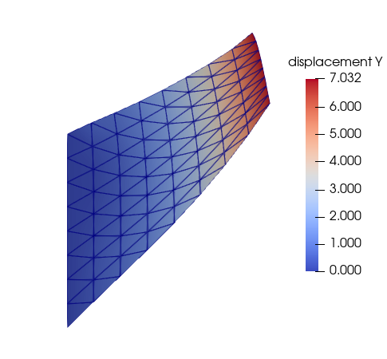
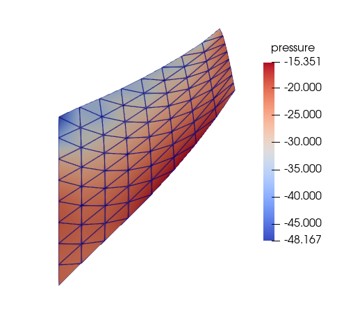
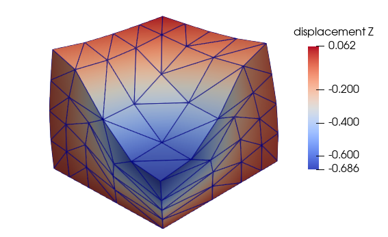
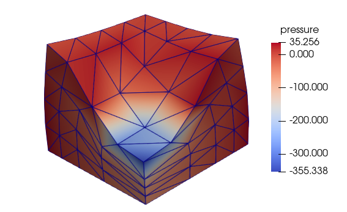

This repository contains source files (Python scripts) for solving elasticity problems using FEniCS library.

Some of the example problems solved are shown below.

## Linear and Hyperelasticity
### Linear elasticity

### Hyperelasticity

#### Cook's membrane in plane-strain condition

#### Block 3D

## Morphoelasticity - Growth-driven deformations

## Magnetomechanics
